# MicArch - Microbe Archiving App  
MicArch is an Android-based app developed for any Android mobile device to support barcode-based long-term cryostorage management. 

The application decodes 2D DataMatrix barcodes from cryotubes arranged in 96-well SBS racks using static flatbed-scanner images. Decoded barcodes are matched with strain identifiers stored in a central Excel file, enabling automated rack annotation and rapid sample localization.

---

## Motivation

Traditional cryostorage identification systems often depend on handwritten labels or expensive proprietary barcode infrastructure. MicArch eliminates the need for handwritten labeling while avoiding dependency on manufacturer-specific scanning devices.

The system is:
- Cost-free
- Hardware-independent (any Android device)
- Compatible with standard flatbed scanner images
- Easily integrable into existing laboratory workflows

## Scientific Context

MicArch was developed as part of a Master's thesis project focused on improving traceability, reproducibility, and efficiency in cryogenic sample storage workflows.
The application demonstrates that robust barcode-based cryostorage management can be implemented using open mobile platforms and widely available laboratory equipment.

---

## System Architecture Overview

MicArch follows a modular processing pipeline:

1. Image acquisition from device storage
2. Rack detection and preprocessing (OpenCV-based)
3. 8 × 12 grid segmentation
4. Per-well barcode decoding (Google ML Kit with fallback mechanisms)
5. Multi-image consensus decoding (majority vote)
6. Integration with central Excel metadata (Apache POI)
7. Annotation rendering and visualization

All computational tasks are executed off the main UI thread using Kotlin coroutines to ensure responsiveness and stability.

### Architectural Principles

- Modular image-processing utilities
- Resolution-independent grid modeling
- Fault-tolerant per-well decoding
- Explicit nullable type handling
- Clean separation between decoding and metadata integration

### App Flowchart

---

## Image Preprocessing Pipeline

Rack images are:

- Rotated to standardized orientation
- Converted to grayscale
- Thresholded
- Analyzed for contours
- Cropped to the largest detected contour (assumed rack region)

This step is encapsulated in the reusable utility function:

`deskewAndCropRackOpenCV`

The resulting normalized rack image serves as input for downstream analysis.

---

## Rack Grid Model

The rack is modeled as a fixed 8 × 12 grid (Rows A–H, Columns 1–12).  
Each well region is dynamically computed based on image resolution.

- Insets are applied to reduce boundary interference
- Each well is decoded independently
- Partial decoding failures do not affect adjacent wells

---

## Barcode Decoding Workflow

Each well sub-image undergoes:

1. Primary decoding via Google ML Kit
2. Optional fallback decoding attempts
3. Storage in a well-to-barcode mapping structure

To improve robustness, MicArch supports multi-scan consensus decoding:
- Results across multiple images are aggregated
- Majority voting determines final barcode assignment

This significantly improves performance under blur, occlusion, or lighting variability.

---

## Excel Metadata Integration

The central Excel (.xlsx) file is parsed using Apache POI.

Workflow:
- User selects the plate column corresponding to the scanned rack
- A mapping between barcode and strain identifier is constructed
- A new Excel file is generated containing matched barcode entries

This design allows barcode decoding and metadata annotation to remain logically independent.

---

## Functional Modules

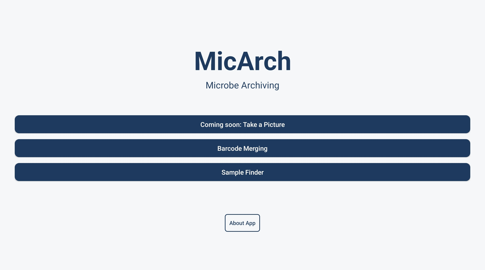

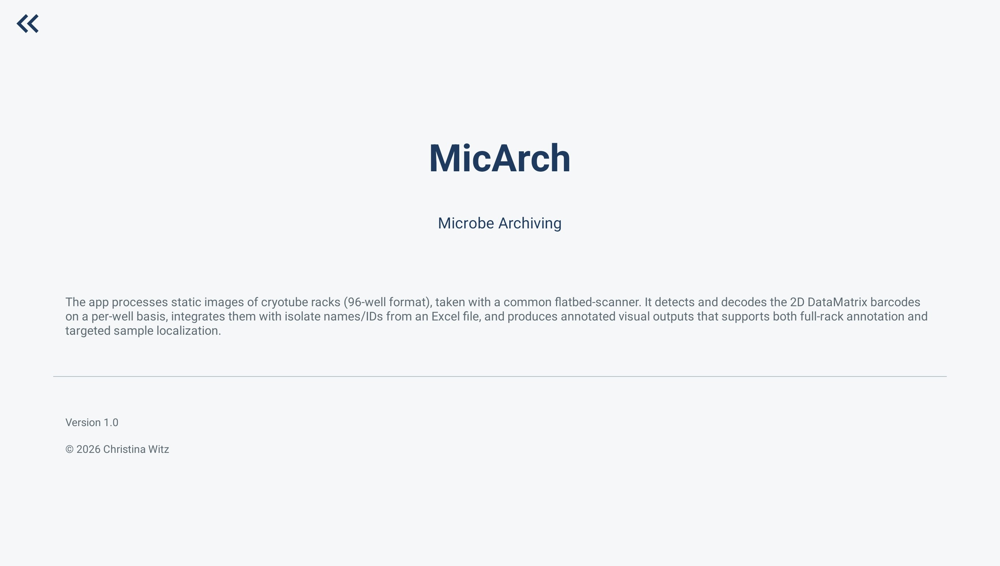

### 1. Barcode Merging Tool

- Decodes rack barcodes
- Matches barcodes with strain identifiers
- Exports enriched Excel file

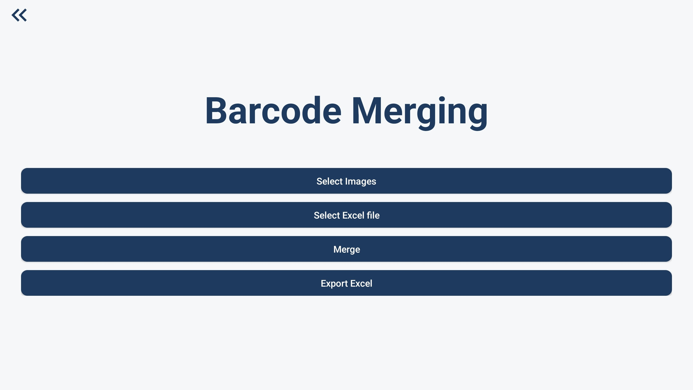

---

### 2. Sample Finder Tool

Supports:

- Targeted strain identifier search
- Full rack annotation
- Visual localization of individual samples

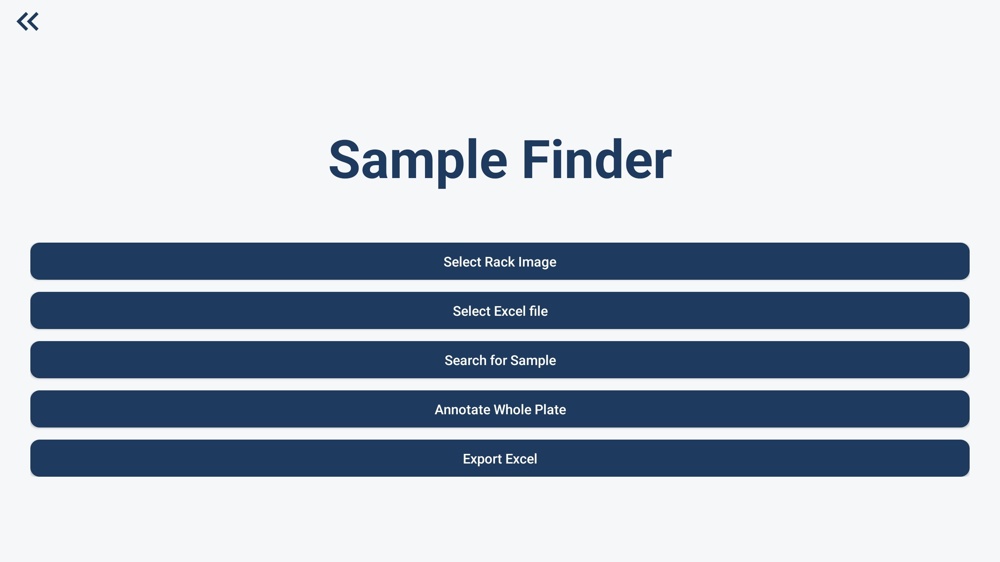

---

## Visualization and Annotation

Annotations are rendered directly onto processed rack bitmaps using Android Canvas and Paint APIs.

Color coding:

- Green: Successful barcode decoding and metadata match
- Red: Unresolved well
- Yellow: Highlighted search result

Example annotated rack:

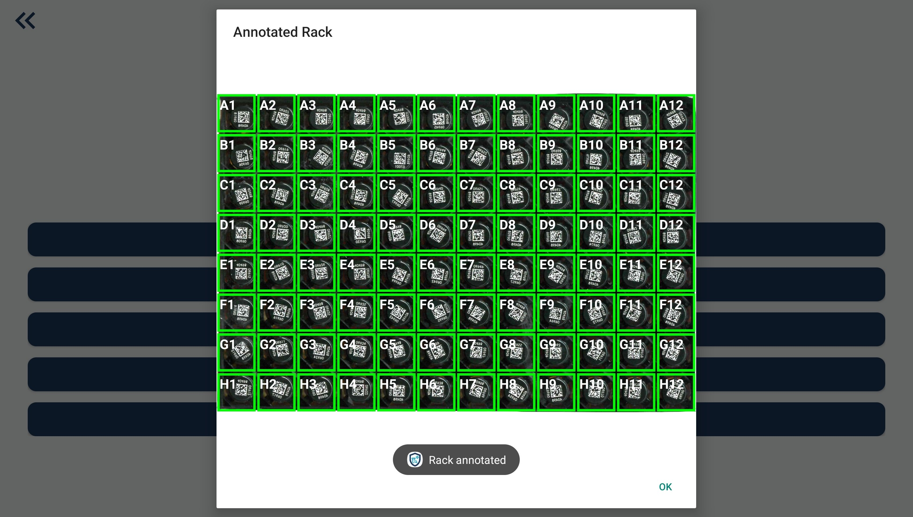

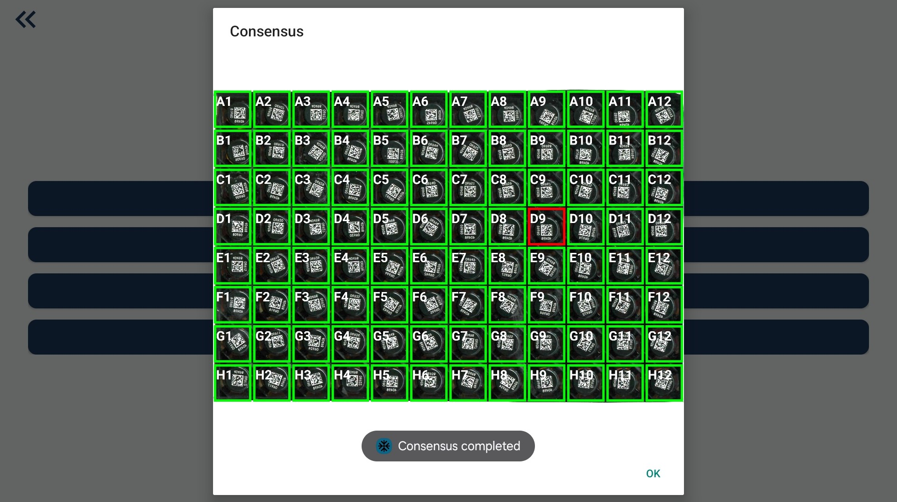

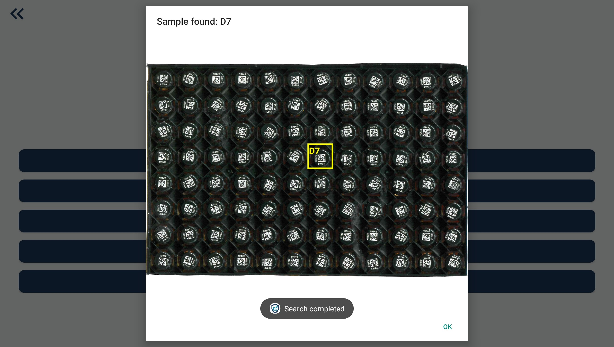

Annotated images can be displayed within the app and optionally exported for documentation.

---

## Technology Stack

- Kotlin
- Android Studio
- OpenCV
- Google ML Kit
- Apache POI
- Kotlin Coroutines

---

## Installation

### Build from Source

1. Clone the repository
2. Open in Android Studio
3. Build and run on Android device

---

## Example Data

- `96-well-template.xlsx` – Central Excel file
- `Scanning.jpg` - Scanning process example
- `Test_image1.jpg`, `Test_image2.jpg`, `Test_image3.jpg` – Example rack scan images

These files illustrate the required data structure for proper use.

---

## Expected Input Format

### Rack Images

- Flatbed-scanner image
- Complete 96-well SBS rack
- Top-down orientation
- Uniform lighting
- No perspective distortion

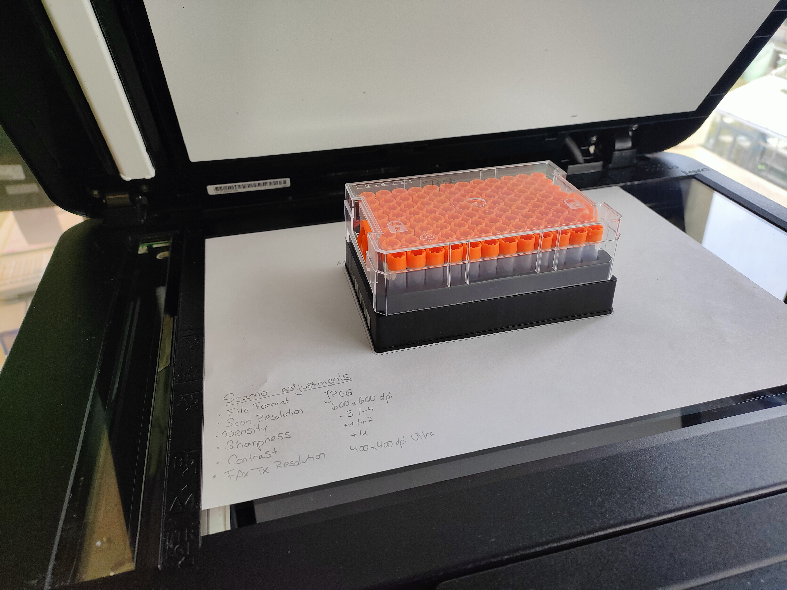

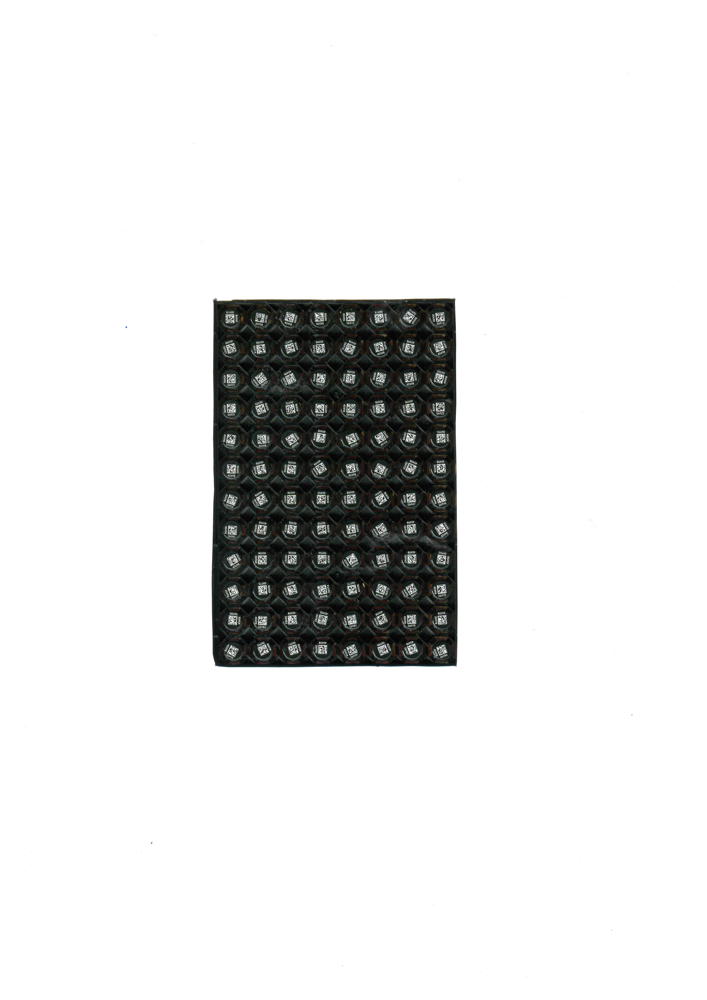

---

### Excel File Structure

- Columns calling "Plate X" (X can be any number) containing strain identifiers (sample names)
- One column named "Well" containing all wells from A1 - A12 until H1 - H12
- List of strain identifiers are transformed into 96-well format on second Excel sheet
- Barcodes will be added in new added column next to chosen Plate-column during merging

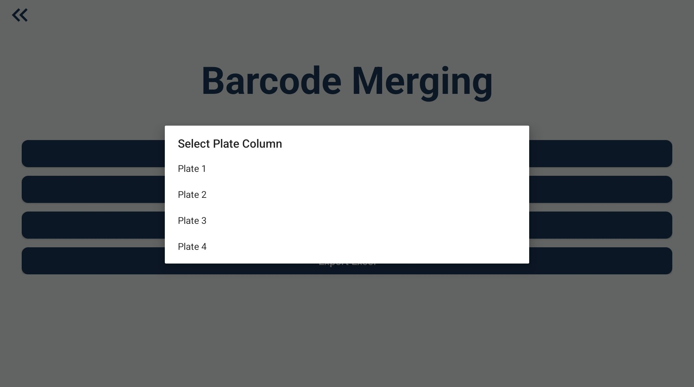

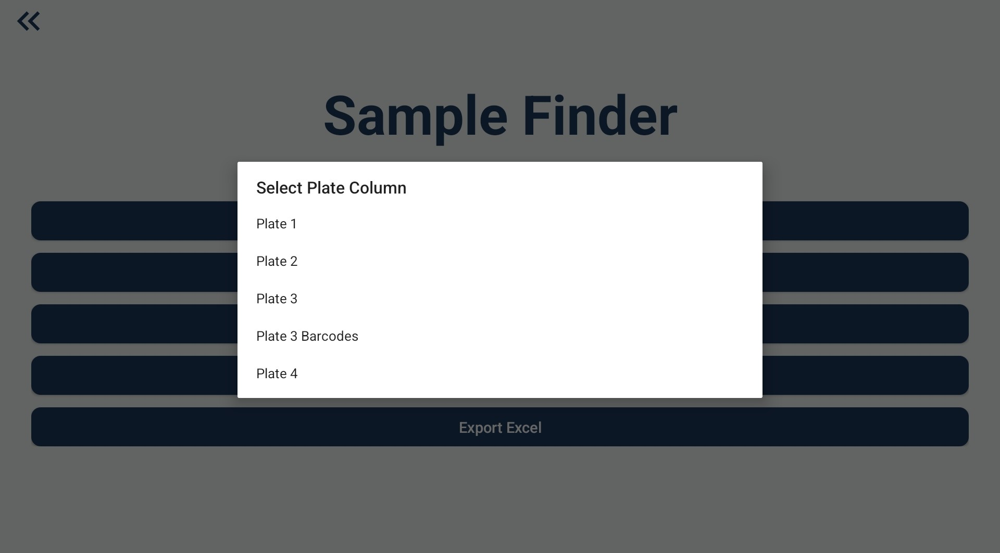

---

## Reproducibility

All example inputs required to test the decoding and annotation workflow are provided in the repository.

The software can be built directly using Android Studio.

---

## Citation

If you use MicArch in academic work, please cite:

[Paper Reference]

---

## License

MIT License
